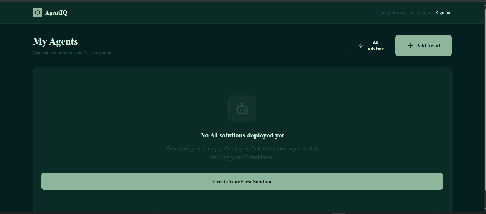
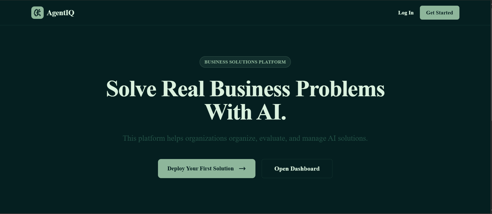
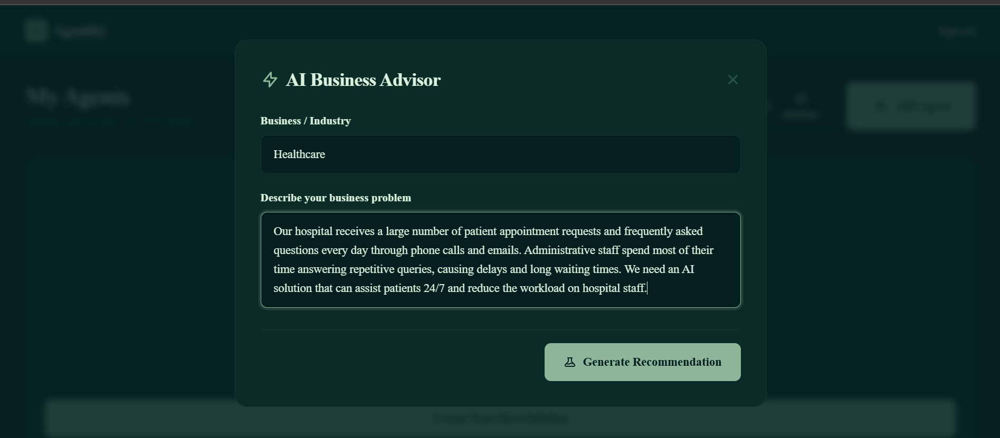
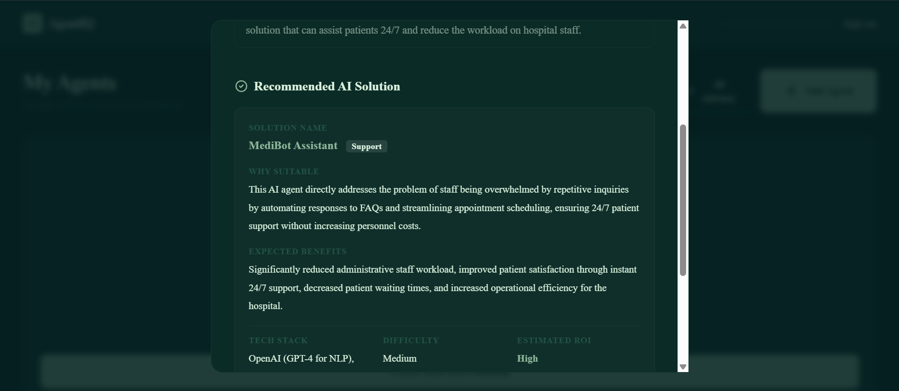
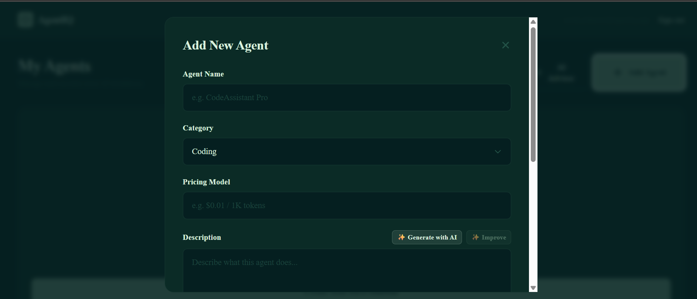
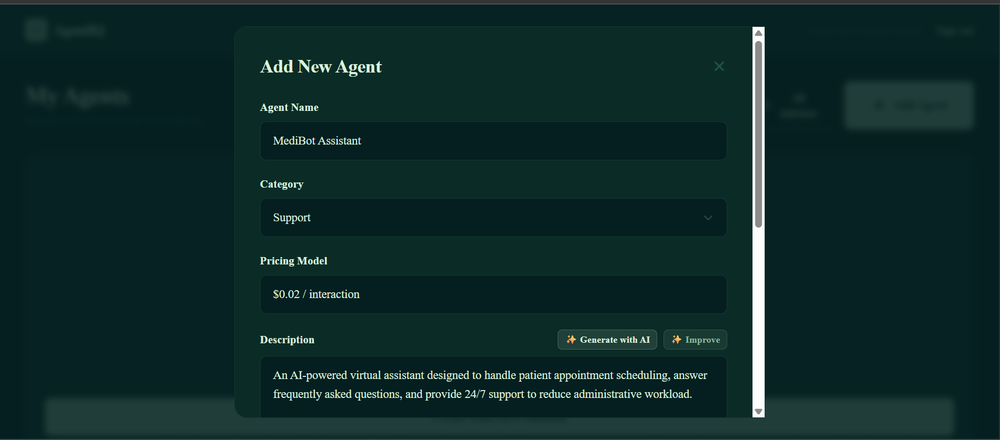

<div align="center">

# 🤖 AgentIQ

### AI-Powered Business Solution Platform

Discover • Generate • Manage AI Solutions


---

### Helping businesses discover the right AI solution and manage it from one intelligent workspace.

</div>

---

# 📖 Overview

Businesses know they need AI.

The difficult part is knowing **which AI solution actually fits their business problem.**

AgentIQ solves this problem by combining **Google Gemini AI** with a modern management platform.

Users simply describe their business challenge.

AgentIQ recommends the most suitable AI solution, explains why it fits, estimates its business value, and allows users to instantly convert that recommendation into a manageable AI Agent.

---

# ✨ Features

## 🔐 Authentication

- JWT Authentication
- User Registration
- Secure Login
- Logout
- Protected Dashboard
- Session Persistence

---

## 🤖 AI Business Advisor

Describe a business challenge and receive:

- AI Solution Recommendation
- Expected Benefits
- Technology Stack
- Estimated ROI
- Implementation Difficulty
- Business Justification

Powered by **Google Gemini 2.5 Flash**

---

## ✨ AI Agent Assistant

Generate professional AI Agent descriptions automatically.

Supports:

- Generate Description
- Improve Existing Description
- AI-assisted writing
- Business-focused documentation

---

## 📊 Agent Management

Manage AI Agents from a single dashboard.

Supports:

- Create Agent
- Edit Agent
- Delete Agent
- Search
- Category Filter
- Sorting
- Business Insights

---

## 🎨 Modern User Experience

- Responsive Design
- Dark SaaS Theme
- Premium Animations
- Interactive Dashboard
- Toast Notifications
- Loading Skeletons

---

# 🚀 Tech Stack

| Frontend | Backend | Database | AI |
|----------|----------|----------|----|
| Next.js 14 | Next.js API Routes | MongoDB | Google Gemini |
| React | Node.js | Mongoose | Gemini REST API |
| TypeScript | JWT | MongoDB Atlas | Native Fetch |
| Tailwind CSS | | | Framer Motion |

---

# 🏗 System Architecture

```text
                    User
                      │
                      ▼
             Next.js Frontend
                      │
        ┌─────────────┴──────────────┐
        │                            │
        ▼                            ▼
 Authentication               AI Services
        │                            │
        ▼                            ▼
 JWT Authentication          Gemini REST API
        │                            │
        └─────────────┬──────────────┘
                      ▼
                  MongoDB
```

---

# 🔄 Application Workflow

```text
Landing Page
      │
      ▼
Register / Login
      │
      ▼
Dashboard
      │
      ├───────────────┐
      │               │
      ▼               ▼
AI Advisor      Manual Creation
      │               │
      ▼               ▼
Gemini AI   AI Description Generator
      │               │
      └───────┬───────┘
              ▼
      Create AI Agent
              │
              ▼
        MongoDB Database
              │
              ▼
     Agent Management Dashboard
```

---
# 📸 Screenshots


| Landing Page | Dashboard |
|--------------|-----------|
|  |  |

| AI Advisor | Recommendation |
|------------|----------------|
|  |  |

| Create Agent | AI Generated Description |
|--------------|--------------------------|
|  |  |

---

# 📂 Project Structure

```text
AgentIQ
│
├── app
│   ├── api
│   ├── dashboard
│   ├── login
│   └── register
│
├── components
│   ├── AIAdvisorModal
│   ├── AgentCard
│   ├── AgentModal
│   └── Counter
│
├── lib
│   ├── auth.ts
│   ├── mongodb.ts
│   ├── businessRules.ts
│   └── getAuthUser.ts
│
├── models
│
├── Assets
│
└── README.md
```

---

# ⚙ Installation

Clone the repository

```bash
git clone https://github.com/SARVESH-GARIBE/AgentIQ.git
```

Move inside

```bash
cd AgentIQ
```

Install packages

```bash
npm install
```

Create

```
.env.local
```

Add

```env
MONGODB_URI=your_mongodb_connection

JWT_SECRET=your_secret

GEMINI_API_KEY=your_gemini_api_key
```

Run

```bash
npm run dev
```

Production Build

```bash
npm run build
npm start
```

---

# 🔑 Environment Variables

```env
MONGODB_URI=

JWT_SECRET=

GEMINI_API_KEY=
```

---

# 🧠 AI Workflow

```text
Business Problem
        │
        ▼
 Gemini AI
        │
        ▼
 Recommendation
        │
        ▼
 Create Agent
        │
        ▼
 AI Generated Description
        │
        ▼
 Save Agent
        │
        ▼
 Dashboard
```

---

# 📈 Future Improvements

- AI Chat Assistant
- Team Collaboration
- Workspace Support
- Agent Analytics
- Role Based Access Control
- AI Marketplace
- Agent Templates
- Export Reports
- Notifications

---

# 🧪 Testing

✔ User Registration

✔ Login

✔ Logout

✔ JWT Authentication

✔ CRUD Operations

✔ Search

✔ Filter

✔ Sort

✔ AI Business Advisor

✔ AI Description Generator

✔ Responsive Design

✔ Build Validation

✔ TypeScript Checks

✔ ESLint Checks

---

# 👨‍💻 Developer

**Sarvesh Garibe**

Computer Science Engineering Student

GitHub

https://github.com/SARVESH-GARIBE

LinkedIn

https://www.linkedin.com/in/sarveshgaribe014/

---

# ⭐ Support

If you found this project helpful, consider giving it a ⭐ on GitHub.

It motivates me to keep building impactful AI applications.

---

<div align="center">

Made with ❤️ using Next.js, MongoDB and Google Gemini AI

</div>
